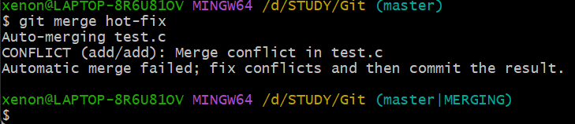
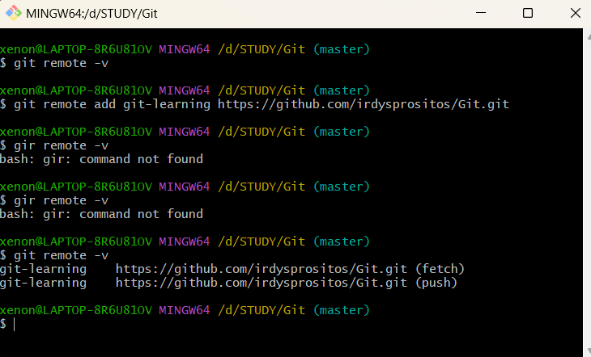
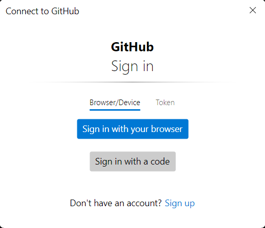
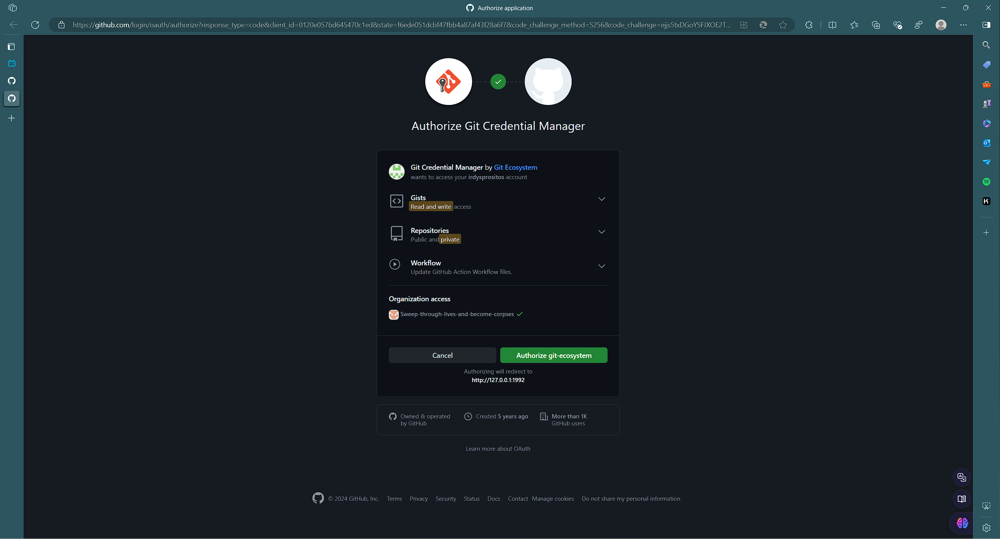
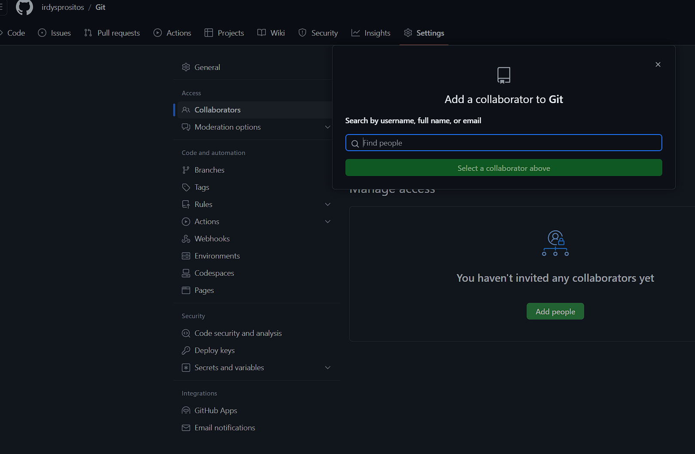
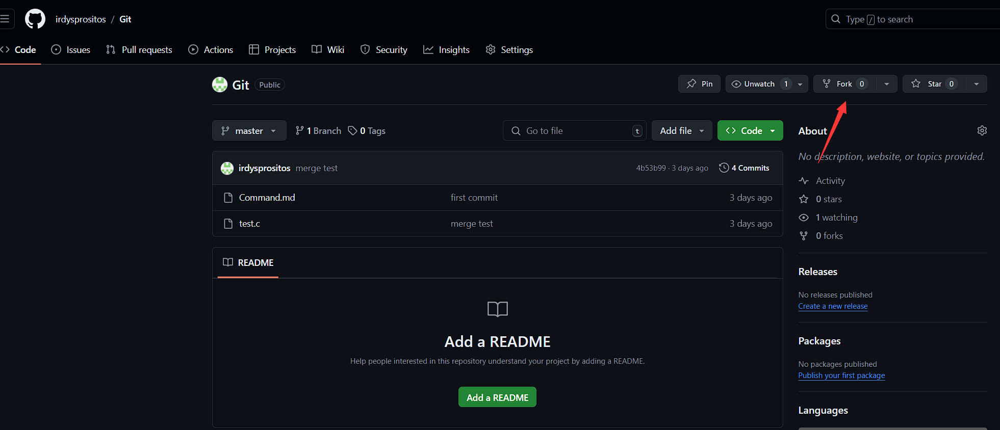
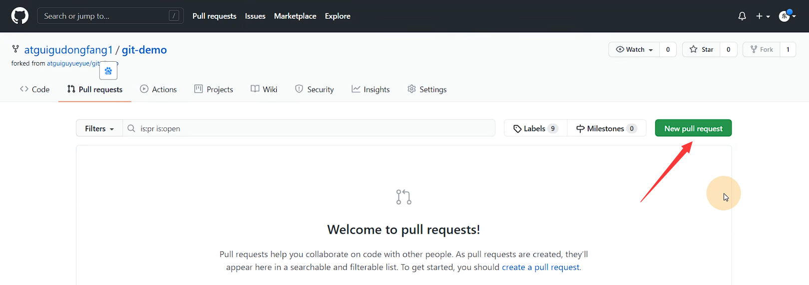
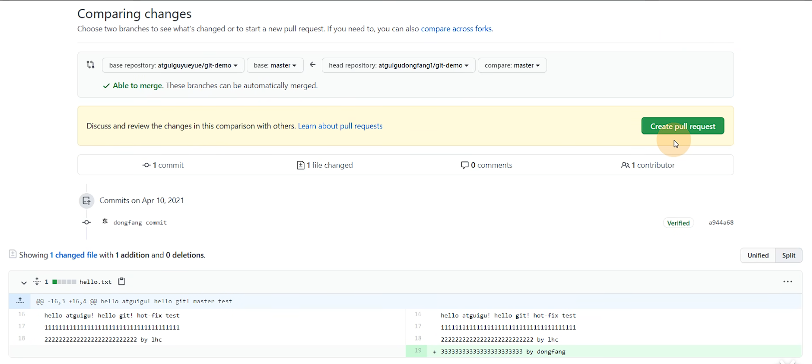
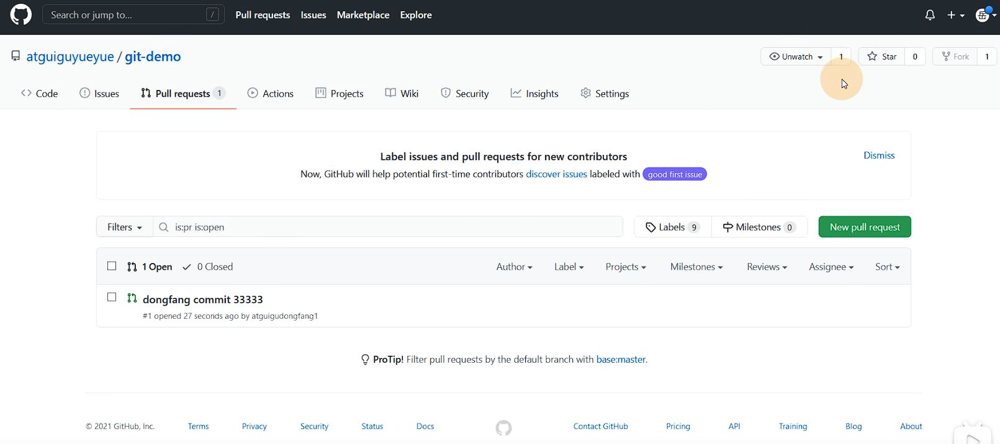
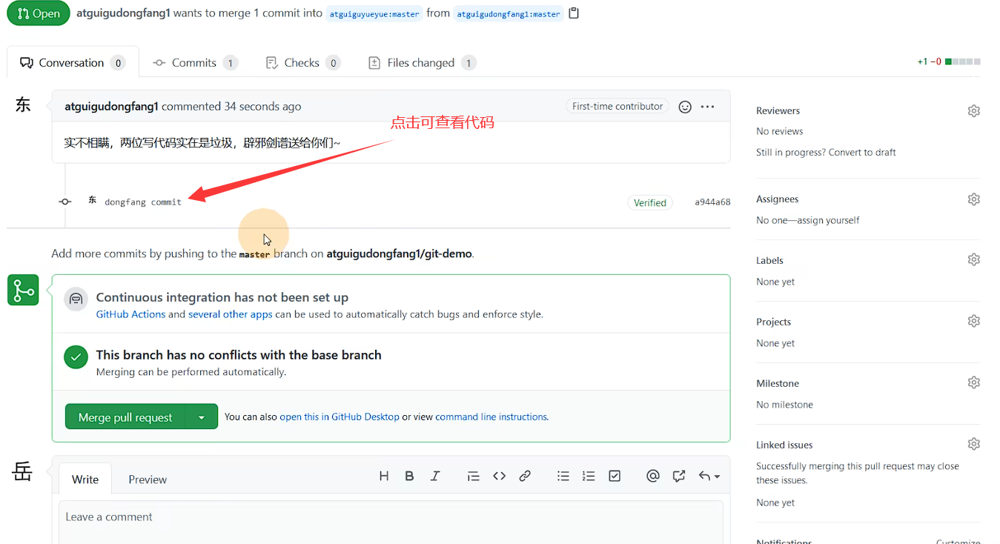

# Git常用命令

## 1.设置用户签名

Git首次安装必须先设置用户签名，否则无法提交代码

```git
git config --global user.name 用户名
git config --global user.email 邮箱
```

可以在 C 盘，用户中，找到 gitconfig 文件
可打开查看用户签名配置

****ATTENTION****
该签名和将来登录的 Github 账号没有关系，只是用来在本地库中标记提交者

## 2.初始化本地库

想用 Git 管理一个目录，首先需要 Git 获取管理权限，即初始化

```git
git init
```

另查看本地库状态

```git
git status
```

tips:

* vim中 ``yy`` 是复制 ``p`` 是粘贴
* 通用 linux 命令，如：``ll`` 查看目录

## 3.新增修改文件

将文件添加到暂存区

```git
git add xxxx.xxxx
git add .            将所有文件拉入暂存区
```

将文件从暂存区删除

```git
git rm --cached <file>...
```

## 4.提交本地库

将暂存区的文件提交到本地库，形成历史版本

```git
git commit -m "日志信息"
```

## 5.版本穿梭

可以通过以下命令查看版本信息

```git
git reflog
git log //详细信息
```

查看版本信息后，可以使用版本号进行版本穿梭

```git
git reset --hard 版本号
```

## 6.分支操作

版本控制中，同时推进多个任务，我们可以创建每个任务的单独分支。使用分支意味着程序员可以把自己的工作从开发主线上分离开来，开发自己分支的时候不会影响主线分支的运行。

查看分支

```git
git branch -v
```

创建分支

```git
git branch 分支名
```

切换分支

```git
git checkout 分支名
```

合并分支

将一个分支合并到当前所在分支

```git
git merge 分支名
```

### 冲突合并

合并分支时，两个分支在同一个文件的同一个位置有两套完全不同的修改，Git 无法替我们决定使用哪一个，必须人为决定新代码内容



打开有冲突的文件手动修改保存结果，并删除特殊符号


然后标准流程，add + commit

注意

* commit时不能在后面跟上文件名否则报错
* 修改后的合并结果只会出现在合并分支上，被合并分支不会变

## 7.远程库

### 远程库创建

在个人主页通过 new 创建远程库,复制远程地址

为远程库创建别名方便使用

查看别名

```git
git remote -v
```

创建别名

```git
git remote add 别名 https:xxxxxx
```



### 本地分支推送&拉取&克隆

```git
git push 别名/远程地址 分支名
```

tips

* 使用 https 远程地址进行登录需要手动 connect
* 
* 

拉取

```git
git pull 别名/远程地址 分支名
```

克隆结果可以直接初始化本地库，甚至别名也克隆下来

```git
git clone 远程地址
```

## 8.成员邀请

其他成员想将代码 push 进远程库需要获取权限——将成员拉入团队



## 9.非团队成员协作

首先需要 Fork 一份副本到自己的账号



任务完成后通过拉取请求将代码合并入原远程库




随后项目管理者可以查看请求，并决定是否合并代码




## 10.SSH免密登录

在路径 `C:\Users\xenon\.ssh` 中可以查看 SSH 密钥
会有三册等待输入，直接回车即可

```git
ssh-keygen -t rsa -C 邮箱
```

密钥生成后在 github 个人账户中添加即可
